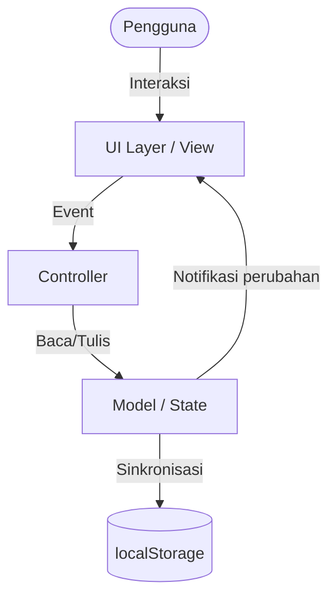
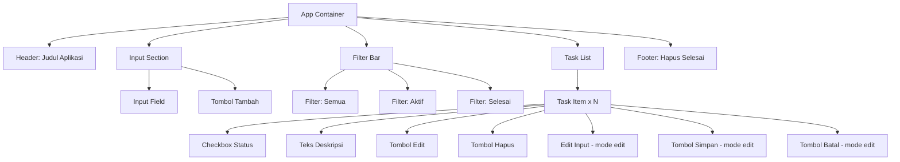

# Design Document: Todolist App

## Overview

Aplikasi Todo List adalah aplikasi frontend berbasis browser yang sepenuhnya berjalan di sisi klien (client-side). Tidak ada server backend — semua logika, state, dan persistensi data dikelola di browser menggunakan vanilla JavaScript, HTML, dan CSS.

Desain visual menggunakan gaya **Neobrutalism**: border hitam tebal, bayangan hitam tajam (hard shadow), sudut kotak (no border-radius), tipografi bold/uppercase, dan palet warna kontras tinggi (kuning terang `#ffe44d` dan merah muda `#ff6b9d` sebagai aksen utama).

Arsitektur utama mengikuti pola **MVC sederhana** yang dipisahkan menjadi tiga lapisan:
- **Model**: Representasi data tugas dan operasi CRUD terhadap `localStorage`
- **View**: Rendering DOM berdasarkan state aplikasi
- **Controller**: Penghubung antara interaksi pengguna dan pembaruan model/view

Aplikasi ini tidak memerlukan build tool atau bundler — dapat dijalankan langsung di browser dengan membuka file `index.html`.

---

## Visual Design System — Neobrutalism

### Prinsip Utama

| Prinsip | Implementasi |
|---|---|
| Border hitam tebal | `3px solid #111111` pada semua elemen interaktif |
| Hard shadow | `box-shadow: 4px 4px 0px #111111` (tidak ada blur) |
| Sudut kotak | `border-radius: 0` — tidak ada rounded corners |
| Tipografi bold | `font-weight: 700–900`, uppercase pada label & tombol |
| Warna kontras tinggi | Kuning `#ffe44d` (aksen utama), merah muda `#ff6b9d` (CTA) |

### Palet Warna

| Token | Nilai | Penggunaan |
|---|---|---|
| `--color-bg` | `#f5f0e8` | Background halaman (krem) |
| `--color-surface` | `#ffffff` | Background kartu/container |
| `--color-primary` | `#ffe44d` | Header, filter aktif, tombol Edit |
| `--color-accent` | `#ff6b9d` | Tombol Tambah (CTA utama) |
| `--color-danger` | `#ff3b3b` | Tombol Hapus, Hapus Selesai |
| `--color-success` | `#00c853` | Tombol Simpan, checkbox |
| `--color-border` | `#111111` | Semua border |
| `--color-text` | `#111111` | Teks utama |

### Shadow System

```css
--shadow-hard-sm:  2px 2px 0px #111111;   /* tombol kecil, input */
--shadow-hard:     4px 4px 0px #111111;   /* elemen fokus */
--shadow-hard-lg:  6px 6px 0px #111111;   /* app container */
```

Efek interaksi tombol: saat hover → shadow hilang + `transform: translate(2px, 2px)` (efek "ditekan").

---

## Architecture



### Alur Data

1. Pengguna berinteraksi dengan UI (klik, ketik, tekan Enter)
2. Event handler di Controller menangkap interaksi
3. Controller memanggil fungsi Model untuk memperbarui state
4. Model menyimpan perubahan ke `localStorage`
5. Controller memanggil fungsi View untuk me-render ulang UI berdasarkan state terbaru

### Prinsip Desain

- **Single source of truth**: Array `tasks` di memori adalah sumber kebenaran; `localStorage` adalah cerminan persisten-nya
- **Immutable updates**: Setiap perubahan menghasilkan array baru (tidak mutasi langsung)
- **Defensive storage**: Semua operasi `localStorage` dibungkus `try/catch`

---

## Components and Interfaces

### Struktur File

```
todolist-app/
├── index.html          # Markup utama
├── style.css           # Styling
└── app.js              # Logika aplikasi (Model + Controller + View)
```

### Komponen UI



### Interface Fungsi Utama

```javascript
// --- MODEL ---

// Membuat task baru
function createTask(description: string): Task

// Menambahkan task ke state
function addTask(description: string): Result<Task, ValidationError>

// Mengubah status task
function toggleTask(id: string): Task

// Mengedit deskripsi task
function editTask(id: string, newDescription: string): Result<Task, ValidationError>

// Menghapus satu task
function deleteTask(id: string): void

// Menghapus semua task selesai
function clearCompleted(): void

// Memfilter task berdasarkan status
function getFilteredTasks(filter: FilterType): Task[]

// --- STORAGE ---

// Menyimpan ke localStorage
function saveTasks(tasks: Task[]): Result<void, StorageError>

// Memuat dari localStorage
function loadTasks(): Result<Task[], StorageError>

// --- VIEW ---

// Render ulang seluruh daftar tugas
function renderTaskList(tasks: Task[]): void

// Render satu task item
function renderTaskItem(task: Task): HTMLElement

// Tampilkan/sembunyikan empty state
function renderEmptyState(message: string): void

// Perbarui state tombol "Hapus Selesai"
function updateClearButton(tasks: Task[]): void
```

---

## Data Models

### Task

```typescript
interface Task {
  id: string;           // UUID v4, unik per task
  description: string;  // Deskripsi tugas, 1–200 karakter, non-whitespace
  completed: boolean;   // false = aktif, true = selesai
  createdAt: number;    // Unix timestamp (Date.now()) saat task dibuat
}
```

### FilterType

```typescript
type FilterType = "all" | "active" | "completed";
```

### AppState

```typescript
interface AppState {
  tasks: Task[];           // Daftar semua tugas (urutan: terbaru pertama)
  currentFilter: FilterType;
  editingTaskId: string | null;  // ID task yang sedang dalam mode edit, atau null
}
```

### Result Type (Error Handling)

```typescript
type Result<T, E> =
  | { ok: true; value: T }
  | { ok: false; error: E };

type ValidationError = "EMPTY_DESCRIPTION" | "DESCRIPTION_TOO_LONG";
type StorageError   = "STORAGE_UNAVAILABLE" | "PARSE_ERROR" | "WRITE_ERROR";
```

### localStorage Schema

Data disimpan di key `"todolist-app-tasks"` sebagai JSON string:

```json
[
  {
    "id": "a1b2c3d4-...",
    "description": "Belajar TypeScript",
    "completed": false,
    "createdAt": 1700000000000
  }
]
```

---

## Correctness Properties

*A property is a characteristic or behavior that should hold true across all valid executions of a system — essentially, a formal statement about what the system should do. Properties serve as the bridge between human-readable specifications and machine-verifiable correctness guarantees.*

### Property 1: Penambahan task memperbesar daftar

*For any* daftar tugas dan deskripsi tugas yang valid (non-kosong, non-whitespace, ≤200 karakter), menambahkan tugas tersebut harus menghasilkan daftar tugas yang panjangnya bertambah tepat satu, dan task baru harus ada di daftar dengan deskripsi yang sama.

**Validates: Requirements 1.1**

---

### Property 2: Validasi deskripsi whitespace berlaku universal

*For any* string yang seluruhnya terdiri dari karakter whitespace (spasi, tab, newline), mencoba menggunakannya sebagai deskripsi — baik saat menambahkan task baru maupun saat mengedit task yang ada — harus ditolak dan state daftar tugas tidak boleh berubah.

**Validates: Requirements 1.2, 4.3**

---

### Property 3: Input field dikosongkan setelah penambahan berhasil

*For any* kondisi UI di mana input field berisi teks valid, setelah penambahan berhasil, nilai input field harus menjadi string kosong.

**Validates: Requirements 1.3**

---

### Property 4: Round-trip persistensi — semua operasi perubahan tersimpan

*For any* urutan operasi perubahan (tambah, edit, toggle, hapus) pada daftar tugas, menyimpan state ke localStorage lalu memuatnya kembali harus menghasilkan daftar tugas yang identik (sama jumlah, sama ID, sama deskripsi, sama status).

**Validates: Requirements 1.4, 2.3, 3.4, 4.5, 5.3, 8.1, 8.2**

---

### Property 5: Toggle status adalah involusi

*For any* task dengan status apapun, melakukan toggle dua kali berturut-turut harus mengembalikan task ke status semula.

**Validates: Requirements 3.1, 3.2**

---

### Property 6: Filter mengembalikan subset yang tepat dan lengkap

*For any* daftar tugas dan pilihan filter ("Semua", "Aktif", atau "Selesai"), semua task yang dikembalikan harus memenuhi kriteria filter tersebut, dan tidak ada satu pun task yang memenuhi kriteria yang terlewat dari hasil filter.

**Validates: Requirements 6.2, 6.3, 6.4**

---

### Property 7: Hapus selesai menghilangkan semua task completed

*For any* daftar tugas yang mengandung minimal satu task selesai, setelah operasi "hapus selesai", tidak boleh ada satu pun task dengan `completed = true` yang tersisa di daftar.

**Validates: Requirements 7.2**

---

### Property 8: Edit task memperbarui deskripsi tanpa mengubah identitas task

*For any* task yang ada dan deskripsi baru yang valid (non-whitespace, ≤200 karakter), setelah edit berhasil, task tersebut harus memiliki deskripsi baru sementara ID dan `createdAt`-nya tetap tidak berubah.

**Validates: Requirements 4.2**

---

### Property 9: Tombol "Hapus Selesai" aktif jika dan hanya jika ada task selesai

*For any* daftar tugas, tombol "Hapus Selesai" harus aktif (enabled) jika dan hanya jika terdapat minimal satu task dengan `completed = true` di daftar tersebut.

**Validates: Requirements 7.1, 7.4**

---

### Property 10: Render task menampilkan deskripsi dan status

*For any* task, hasil render elemen DOM-nya harus mengandung teks deskripsi task tersebut dan indikator visual yang mencerminkan status `completed`-nya (misalnya class CSS atau atribut checkbox).

**Validates: Requirements 2.4, 3.3**

---

## Error Handling

### Validasi Input

| Kondisi | Perilaku |
|---|---|
| Deskripsi kosong atau hanya whitespace | Tolak, tampilkan pesan error inline, pertahankan state |
| Deskripsi > 200 karakter | Batasi input di UI (maxlength) atau tolak dengan pesan error |
| Edit dengan deskripsi kosong/whitespace | Tolak, kembalikan ke deskripsi sebelumnya |

### localStorage Errors

Semua operasi `localStorage` dibungkus `try/catch`:

```javascript
function saveTasks(tasks) {
  try {
    localStorage.setItem("todolist-app-tasks", JSON.stringify(tasks));
    return { ok: true, value: undefined };
  } catch (e) {
    showErrorBanner("Gagal menyimpan data. Perubahan mungkin tidak tersimpan.");
    return { ok: false, error: "WRITE_ERROR" };
  }
}

function loadTasks() {
  try {
    const raw = localStorage.getItem("todolist-app-tasks");
    if (!raw) return { ok: true, value: [] };
    return { ok: true, value: JSON.parse(raw) };
  } catch (e) {
    showErrorBanner("Gagal memuat data. Memulai dengan daftar kosong.");
    return { ok: false, error: "PARSE_ERROR" };
  }
}
```

### Error Banner

Pesan error ditampilkan sebagai banner non-blocking di bagian atas aplikasi, dapat ditutup oleh pengguna. Error tidak menghentikan operasi aplikasi — aplikasi tetap berjalan dengan state yang ada.

---

## Testing Strategy

### Pendekatan Dual Testing

Strategi pengujian menggunakan dua lapisan yang saling melengkapi:

1. **Unit Tests (example-based)**: Memverifikasi perilaku spesifik dengan contoh konkret
2. **Property-Based Tests (PBT)**: Memverifikasi properti universal di seluruh ruang input

### Library yang Digunakan

- **Test runner**: [Vitest](https://vitest.dev/) — kompatibel dengan browser environment dan ESM
- **Property-based testing**: [fast-check](https://fast-check.io/) — library PBT untuk JavaScript/TypeScript
- **DOM testing**: [jsdom](https://github.com/jsdom/jsdom) (via Vitest environment)

### Unit Tests

Fokus pada:
- Skenario spesifik yang mendemonstrasikan perilaku benar
- Titik integrasi antar komponen (Model ↔ Storage, Controller ↔ View)
- Edge case dan kondisi error

Contoh:
```javascript
// Contoh unit test
test("menambahkan task dengan deskripsi valid", () => {
  const result = addTask("Belajar JavaScript");
  expect(result.ok).toBe(true);
  expect(result.value.description).toBe("Belajar JavaScript");
});

test("menolak task dengan deskripsi kosong", () => {
  const before = getTasks().length;
  const result = addTask("");
  expect(result.ok).toBe(false);
  expect(getTasks().length).toBe(before);
});
```

### Property-Based Tests

Setiap properti diimplementasikan sebagai satu property-based test dengan minimum **100 iterasi**.

Setiap test diberi tag komentar dengan format:
`// Feature: todolist-app, Property {N}: {deskripsi singkat}`

Contoh implementasi:

```javascript
import fc from "fast-check";

// Feature: todolist-app, Property 1: Penambahan task memperbesar daftar
test("Property 1: menambahkan task valid selalu memperbesar daftar", () => {
  fc.assert(
    fc.property(
      fc.array(validTaskArb),          // daftar awal sembarang
      fc.string({ minLength: 1, maxLength: 200 }).filter(s => s.trim().length > 0), // deskripsi valid
      (initialTasks, description) => {
        setState(initialTasks);
        const before = getTasks().length;
        addTask(description);
        expect(getTasks().length).toBe(before + 1);
      }
    ),
    { numRuns: 100 }
  );
});

// Feature: todolist-app, Property 2: Deskripsi whitespace ditolak
test("Property 2: deskripsi whitespace selalu ditolak", () => {
  fc.assert(
    fc.property(
      fc.array(validTaskArb),
      fc.stringOf(fc.constantFrom(" ", "\t", "\n")),  // string whitespace sembarang
      (initialTasks, whitespaceDesc) => {
        setState(initialTasks);
        const before = getTasks().length;
        addTask(whitespaceDesc);
        expect(getTasks().length).toBe(before);
      }
    ),
    { numRuns: 100 }
  );
});

// Feature: todolist-app, Property 5: Toggle status adalah involusi
test("Property 5: toggle dua kali mengembalikan status semula", () => {
  fc.assert(
    fc.property(
      validTaskArb,
      (task) => {
        const original = task.completed;
        const toggled = toggleTask(task).completed;
        const restored = toggleTask({ ...task, completed: toggled }).completed;
        expect(restored).toBe(original);
      }
    ),
    { numRuns: 100 }
  );
});
```

### Cakupan Test per Requirement

| Requirement | Tipe Test | Property/Unit |
|---|---|---|
| 1.1 Tambah task valid | Property | Property 1 |
| 1.2 Tolak whitespace saat tambah | Property | Property 2 |
| 1.3 Kosongkan input | Property | Property 3 |
| 1.4 Simpan ke localStorage | Property | Property 4 |
| 1.5 Batas 200 karakter | Unit | Edge case |
| 2.1 Urutan terbaru pertama | Unit | Contoh konkret |
| 2.2 Empty state | Unit | Contoh konkret |
| 2.3 Load dari localStorage | Property | Property 4 |
| 2.4 Tampilkan deskripsi & status | Property | Property 10 |
| 3.1–3.2 Toggle status | Property | Property 5 |
| 3.3 Tampilan visual diperbarui | Property | Property 10 |
| 3.4 Simpan perubahan status | Property | Property 4 |
| 4.1 Masuk mode edit | Unit | Contoh konkret |
| 4.2 Edit berhasil | Property | Property 8 |
| 4.3 Tolak whitespace saat edit | Property | Property 2 |
| 4.4 Cancel edit (Escape) | Unit | Contoh konkret |
| 4.5 Simpan setelah edit | Property | Property 4 |
| 5.1–5.3 Hapus task | Unit | Contoh konkret |
| 5.4 Empty state setelah hapus | Unit | Contoh konkret |
| 6.1 Tiga tombol filter ada | Unit | Contoh konkret |
| 6.2–6.4 Filter | Property | Property 6 |
| 6.5 Empty state filter kosong | Unit | Contoh konkret |
| 7.1 Tombol aktif/nonaktif | Property | Property 9 |
| 7.2 Hapus semua selesai | Property | Property 7 |
| 7.3–7.4 Persistensi & state tombol | Property | Property 4, 9 |
| 8.1–8.2 Persistensi | Property | Property 4 |
| 8.3–8.4 Error localStorage | Unit | Edge case |
